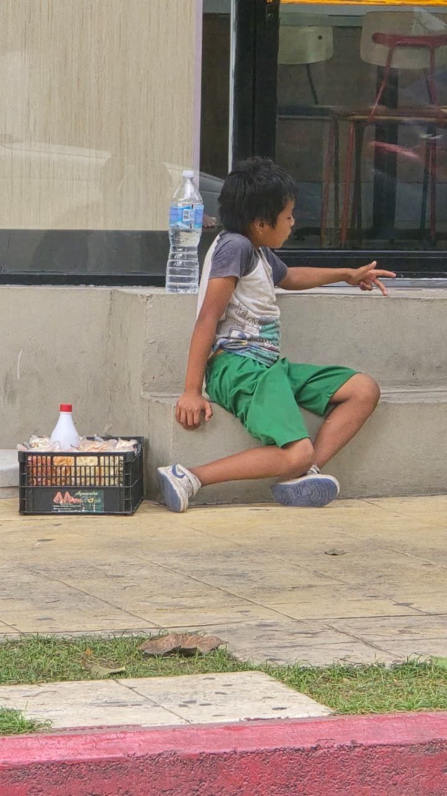
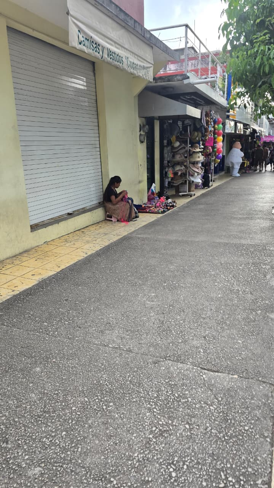
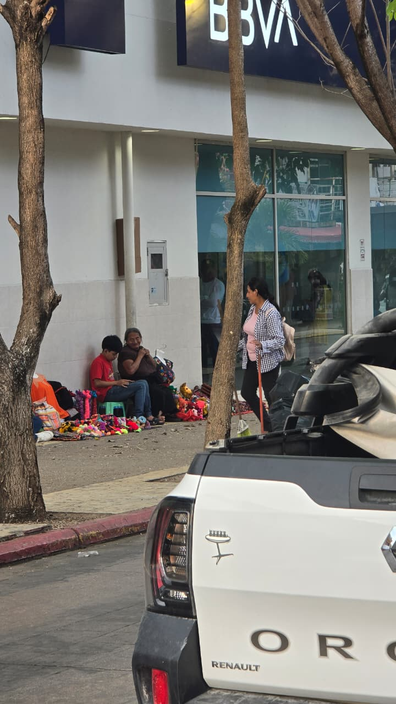
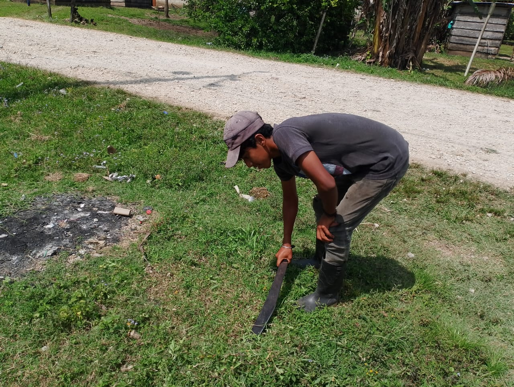
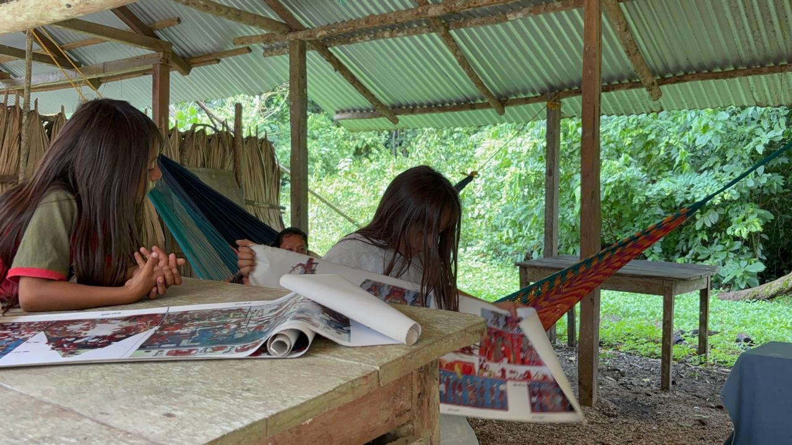

## 0. Activar librerías

```{python}
import plotly.graph_objects as go
import pandas as pd
from pathlib import Path
import numpy as np
import matplotlib.pyplot as plt
import plotly.express as px
```


# Inicio {#inicio}

## Row {height=700px}

::: {style="text-align: center; padding: 2rem;"}

[**Más allá de las barreras**]{.texto-guinda .texto-titulo}

[**En una comunidad indígena de Chiapas, Nikté camina todos los días para llegar a la escuela. Su entusiasmo por aprender son grandes, pero se enfrenta con la dificultad de que sus clases se imparten en español y su lengua materna es el tzeltal. Al salir de la escuela se dirige a su casa, donde aprende a hacer artesanías para después salir a vender, esto provoca que el tiempo para estudiar sea limitado, además que en su comunidad no cuenta con el Servicio de Energía Eléctrica.
Este hecho evidencia que el acceso a la educación no es igual para todos y depende de diversos factores sociales y económicos. Ante ello, surge una pregunta fundamental:**]{.texto-negro .texto-normal}

[**¿Hasta qué punto el lugar donde nace una persona determina sus oportunidades educativas?**]{style="color: #f2c1c1 !important; font-size: 1.2rem; display: block; font-style: italic;"}


::: {.slider}







:::

[Una realidad que muchos no ven](https://www.instagram.com/p/DXfLOqzFhSp/?utm_source=ig_web_copy_link&igsh=MzRlODBiNWFlZA==)

:::


# 1 {#rezago-educativo}
## Row {height=150px}
::: {style="background-color: #008B8B; padding: 1rem 1.5rem; border-radius: 6px;"}

[**Rezago educativo**]{style="color: white !important; font-size: 1.8rem; display: block;"}

[Porcentaje de rezago educativo por entidad en 2024]{style="color: white !important; font-size: 0.9rem; display: block;"}
:::
## Row {height=700px}

De acuerdo con datos del INEGI, en el estado de **Chiapas** el **34 %** de la población estatal (**5,543,828**) presenta uno de los niveles más altos de rezago educativo en el país. Las carencias sociales y su vulnerabilidad provoca que muchos estudiantes no puedan continuar con sus estudios.

[**Grado promedio de escolaridad por entidad en 2020**]{.texto-guinda .texto-grande}

Entidades como **Chiapas**, Oaxaca y Guerrero presentan los niveles más altos de rezago educativo y el grado promedio de escolaridad son los más bajos en el país. Esto indica que el rezago educativo afecta principalmente a las regiones con mayores condiciones de vulnerabilidad y está fuertemente relacionado con factores como el desarrollo económico, el acceso a servicios educativos y las condiciones sociales.

```{python}
ruta= "C:/Users/jaryp/Desktop/Codigo_G/datos/Grad_prom_escol_entid.csv"
df = pd.read_csv(ruta, encoding="latin1", index_col=0, skiprows=0)
```

El promedio de escolaridad en **Chiapas** es de apenas **8 años**, lo que significa que muchas niñas y niños dejan de estudiar empezando la primaria. Esta situación refleja las dificultades que enfrentan miles de niñas, niños y jóvenes para permanecer en el sistema educativo, evidenciando una problemática que limita su desarrollo personal y sus oportunidades a futuro.

{height=300px}

[Niñez en dos mundos: trabajo y aprendizaje](https://www.instagram.com/p/DXgJ_YiFo7C/?utm_source=ig_web_copy_link&igsh=MzRlODBiNWFlZA==)

```{python}
#| scrolled: true
ruta= "C:/Users/jaryp/Desktop/Codigo_G/datos/Rezago_educativo_entid.csv"
df = pd.read_csv(ruta, encoding="latin1", index_col=0, skiprows=0)
```

```{python}
#| fig-cap: "Fuente: [INEGI](https://www.inegi.org.mx/app/tabulados/pxwebclient/default.html?pxq=BISE_BISE_0AojJWW6_260410180243_857b58e4-4535-4ae2-8b62-063f558de743). Elaboración propia."
fig = px.bar(df, x="Porcentaje", y= df.index, title="Rezago educativo por entidad 2024", color_discrete_sequence=['red'] ,height=1000)
fig.update_xaxes(range=[5, 35], ticks="outside")
```


# 2 {#lengua-indigena}
## Row {height=600px}
::: {style="background-color: #D3D3D3; padding: 1rem 1.5rem; border-radius: 6px;"}
**Lengua indígena**

[**Estados con mayor población que habla lengua indígena**]{.texto-guinda .texto-grande}

El entorno en las aulas continúan con una barrera lingüística, cuando las niñas y niños llegan la etapa de la educación básica y en los centros educativos se encuentran con profesores que no hablan su lengua originaria. Esa diferencia no es menor, implica aprender en una lengua que no dominan completamente, lo que dificulta la comprensión y desempeño académico. Por lo tanto, la educación bilingüe es fundamental para mejorar el aprendizaje de niñas y niños indígenas.

```{python}
ruta = "C:/Users/jaryp/Desktop/Codigo_G/datos/Pob_Lengua_indigena.xlsx"
df = pd.read_excel(ruta, index_col=0, skiprows=6)
```
```{python}
df_filtrado= df.loc[["Chiapas", "Oaxaca", "Veracruz de Ignacio de la Llave"]]
```
```{python}
#| fig-cap: "Fuente: [Datos Abiertos de México](https://www.datos.gob.mx/dataset/pobreza_mexico/resource/1e5a4536-b6dd-4dde-900a-7198797d9843). Elaboración propia."
fig = px.bar(df_filtrado, x="2020", y= df_filtrado.index, color_discrete_sequence=['yellow'],height=200)
fig.update_xaxes(range=[500000, 1500000], ticks="outside")
```
**Chiapas**, Oaxaca y Veracruz son los estados con mayor número de hablantes de lengua indígena en el país. En el caso de Chiapas, existen municipios con una alta concentración de población hablante de lenguas indígenas.
:::

## Row {height=1300px}
### Column {width=60%}
#### row {height="50%"}
::: {style="background-color: #e0d8d8; padding: 1rem 1.5rem; border-radius: 6px;"}

[**Municipios de Chiapas con mayor población indígena**]{.texto-guinda .texto-grande}
```{python}
ruta= "C:/Users/jaryp/Desktop/Codigo_G/datos/Pob_indigena_minicipio.csv"
df = pd.read_csv(ruta, encoding="latin1", index_col=4, skiprows=0)
```

```{python}
df_filtrado = df.loc[["Ocosingo", "Chilón", "San Cristóbal de las Casas","Chamula"]]
```

```{python}
#| fig-cap: "Fuente: [Datos Abiertos de México](https://www.datos.gob.mx/dataset/pobreza_mexico/resource/1e5a4536-b6dd-4dde-900a-7198797d9843). Elaboración propia."
fig = px.bar(df_filtrado, x="Poblacion", y= df_filtrado.index, color_discrete_sequence=['blue'],height=100)
fig.update_xaxes(range=[100000, 220000], ticks="outside")
```
:::

#### row {height="50%"}
::: {style="background-color: #e0d8d8; padding: 1rem 1.5rem; border-radius: 6px;"}

[**Municipios con mayor número de hablantes de lengua indígena en Chiapas**]{.texto-guinda .texto-grande}
```{python}
ruta= "C:/Users/jaryp/Desktop/Codigo_G/datos/Pob_lengua_munic_Chiapas.csv"
df = pd.read_csv(ruta, encoding="latin1", index_col=1, skiprows=3)
```

```{python}
df = df.drop(["clave"],axis=1)
```

```{python}
df_filtrado = df.loc[["Ocosingo", "Chilón", "Chamula"]]
```

```{python}
#| fig-cap: "Fuente:  [INEGI](https://www.inegi.org.mx/app/tabulados/pxwebclient/default.html?pxq=BISE_BISE_ObiNLWW6_260409145452_f71468ef-7dce-44a6-9c4a-2e440f6eb7de). Elaboración propia."
fig = px.bar(df_filtrado, x="Población", y= df_filtrado.index, color_discrete_sequence=['purple'],height=100)
fig
```

Los municipios con mayor población de hablantes de lengua indígena son **Ocosingo, Chilón y Chamula**, donde predominan lenguas como el **tzeltal, el tzotzil y el ch´ol**. Esta diversidad lingüística refleja una riqueza cultural importante, pero también evidencia desafíos en el acceso a una educación inclusiva.
:::


### Column {width=60%}
::: {style="background-color: #beb7b7; padding: 1rem 1.5rem; border-radius: 6px;"}

[**Municipios con mayor porcentanje de pobreza de la población indígena de Chiapas**]{.texto-guinda .texto-grande}

La pobreza no solo alude la falta de ingresos, sino también va relacionado con las condiciones de vida, que vulneran la dignidad y limitan los derechos de las personas. 

**En Chiapas, 8 de cada 10 personas indígenas**  viven en condiciones de **pobreza**, lo que limita las oportunidades educativas. De los 4,958,239 pobladores indígenas, 3,966,591 pobladores son pobres.
```{python}
ruta= "C:/Users/jaryp/Desktop/Codigo_G/datos/Pob_Indgna_municipio_pobreza.csv"
df = pd.read_csv(ruta, encoding="latin1", index_col=4, skiprows=0)
```

```{python}
df1 = df.drop(['id','clave_entidad','Entidad_federativa','Clave_municipio','Grupo','poblacion'], axis =1 )
```

```{python}
df_filtrado=  df1.loc[["San Juan Cancuc", "Chanal", "Aldama","Chalchihuitán","Chenalhó","San Andrés Duraznal","Mitontic","Oxchuc","Tila","Pantelhó"]]
```

```{python}
#| fig-cap: "Fuente: [Datos Abiertos de México](https://www.datos.gob.mx/dataset/pobreza_mexico/resource/1e5a4536-b6dd-4dde-900a-7198797d9843). Elaboración propia."
fig = px.bar(df_filtrado, x='Pobreza',y= df_filtrado.index, color_discrete_sequence=['orange'])
fig.update_xaxes(range=[97, 100])
```

Resulta preocupante observar que el porcentaje de pobreza de la población indígena en estos municipios es demasiado alto. Esta situación implica múltiples carencias que afectan directamente la posibilidad de acceder a una educación de calidad. Por un lado, la falta de recursos económicos limita el acceso a materiales escolares, transporte y alimentación adecuada, elementos básicos para el aprendizaje. Por otro, las condiciones de vida obligan a muchos niños y jóvenes a incorporarse al trabajo desde edades tempranas, reduciendo el tiempo y la energía que pueden dedicar a sus estudios.

{width=50% style="display: block; margin-left: auto; margin-right: auto;"}

[Mujeres Indígenas en San Juan Chamula](https://commons.wikimedia.org/wiki/File:Mujeres_Ind%C3%ADgenas_en_San_Juan_Chamula.jpg)

:::

# 3 {#trabajo-infantil}


## Row {height=100px}
::: {style="background-color: #62bebe; padding: 1rem 1.5rem; border-radius: 6px;"}
[**Rezago habitacional**]{.texto-blanco  .texto-grande}
:::

## Row {height=400px}
Se define como *“el número de viviendas con materiales precarios en pisos, techos y muros, que no cuentan con excusado o aquellas cuyos residentes habitan en hacinamiento”*.

::: {.panel-tabset}

## Chamula

::: columns

::: column
```{python}
#| content: valuebox
#| title: "Total de viviendas"
dict(
  color = "success",
  icon = "house",
  value = "22,604"
 )
```
:::

::: column
```{python}
#| content: valuebox
#| title: "Viviendas en rezago habitacional"
dict(
  color = "secondary",
  icon = "house-dash",
  value = "16,729"
 )
```
:::

::: column
```{python}
#| content: valuebox
#| title: "Porcentaje de total de viviendas Rezago habitacional"
dict(
  color = "dark",
  value = "74%",
  icon = "percent"
)
```
:::

:::


## Chilón

::: columns

::: column
```{python}
#| content: valuebox
#| title: "Total de viviendas"
dict(
  color = "success",
  icon = "house",
  value = "25,759 "
 )
```
:::

::: column
```{python}
#| content: valuebox
#| title: "Viviendas en rezago habitacional"
dict(
  color = "secondary",
  icon = "house-dash",
  value = "24,928"
 )
```
:::

::: column
```{python}
#| content: valuebox
#| title: "Porcentaje de total de viviendas Rezago habitacional"
dict(
  color = "dark",
  value = "96.8% ",
  icon = "percent"
)
```
:::

:::


## Ocosingo

::: columns

::: column
```{python}
#| content: valuebox
#| title: "Total de viviendas"
dict(
  color = "success",
  icon = "house",
  value = "45,868"
 )
```
:::

::: column
```{python}
#| content: valuebox
#| title: "Viviendas en rezago habitacional"
dict(
  color = "secondary",
  icon = "house-dash",
  value = "39,462"
 )
```
:::

::: column
```{python}
#| content: valuebox
#| title: "Porcentaje de total de viviendas Rezago habitacional"
dict(
  color = "dark",
  value = "86%",
  icon = "percent"
)
```
:::
:::

:::


## Row {height=100px}
::: {style="background-color: #62bebe; padding: 1rem 1.5rem; border-radius: 6px;"}

[**Trabajo infantil**]{.texto-blanco  .texto-grande}

:::

## Row {height=1200px}
### Column {width=50%}
::: {style="background-color: #65bfc479; padding: 1rem 1.5rem; border-radius: 6px;"}
En 2022, en **Chiapas**, habían 1,626,601 **niñas, niños y adolescentes** que tenían entre 5 y 17 años. Del total estatal se registraron **228,406 personas** en este rango de edad que desempeñaban alguna ocupación,correspondiente al **14.04%** del valor estatal.
**7 de cada 10** trabaja en el *sector agrícola*, **2 de cada 10** en el *sector comercio y servicios*, y **1 de cada 10** en la *industria y construcción*.
Los **niñas, niños y adolescentes inadígenas** son los principales en sufrir este problema, ya que el sector agrícola es preponderante en su zona, y por su tradición y cultura es común observarlos vender sus productos artesanales. 

{width=50% style="display: block; margin-left: auto; margin-right: auto;"}

[Entre hilos y esperanza: crecer trabajando](https://www.instagram.com/p/DXgJ_YiFo7C/?utm_source=ig_web_copy_link&igsh=MzRlODBiNWFlZA==)

:::

### Column {width=50%}
::: {style="background-color: #65bfc479; padding: 1rem 1.5rem; border-radius: 6px;"}
Además de la pobreza y las necesidades económicas, hay otras causas detrás del trabajo infantil.En el ámbito rural y en las familias indígenas se considera que el trabajo es benéfico para el sano desarrollo de **NNA**, ya que los sitúa frente a responsabilidades, los ayuda a madurar y les aporta una experiencia de aprendizaje que difícilmente podrían obtener en la escuela, la casa o en el espacio recreativo.

Esta realidad evidencia una profunda desigualdad, mientras algunos estudiantes cuentan con recursos y apoyos, otros enfrentan múltiples barreras desde el inicio, lo que convierte la educación en un privilegio más que un derecho garantizado.

{width=80% style="display: block; margin-left: auto; margin-right: auto;"}

[Vendedores en el mercado de San Juan Chamula,Chiapas](https://commons.wikimedia.org/wiki/File:Futuro_De_M%C3%A9xico.jpg)

:::

# 4 {#servicios-educativos}
## Row {height=600px}
::: {style="background-color: #78143e7f; padding: 1rem 1.5rem; border-radius: 5px;"}
[**Servicios educativos que presta educación indígena en diversos municipios del estado de Chiapas**]{.texto-blanco  .texto-grande}

```{python}
ruta = "C:/Users/jaryp/Desktop/Codigo_G/datos/Serv_educa_presta_edu_indgna.xlsx"
df = pd.read_excel(ruta, index_col=0, skiprows=0)
```

```{python}
#| scrolled: true
#| fig-cap: "Fuente:[Dirección de Educación Indígena](https://www.educacionchiapas.gob.mx/docentes-y-administrativos/subsecretaria-de-educacion-federalizada/educacion-indigena/). Elaboración propia."
df.plot.bar(stacked=True, figsize=(12,6), title="Prestan educación indígena");
```

**Chilón** y **Ocosingo** son los municipios en los que la implementación del servicio educativo indígena en instalaciones tanto inicial, preescolar, primaria y albergues. A pesar de ello la educación de calidad escaso.
:::

## Row {height=800px}
### Column {width=50%}
::: {style="background-color: #ffffff7f; padding: 1rem 1.5rem; border-radius: 5px;"}
Existen esfuerzos orientados a mejorar la situación educativa en las comunidades indígenas, como los programas de educación bilingüe. Estos avances resultan aún limitados frente a la magnitud del problema. Esta realidad invita a reflexionar sobre la necesidad de fortalecer políticas educativas verdaderamente incluyentes, que reconozcan y atiendan las condiciones sociales, culturales y lingüísticas de estas comunidades. Solo así será posible avanzar hacia una educación que no sea un privilegio de unos cuantos, sino un derecho efectivo y garantizado para todos.

{width=60% style="display: block; margin-left: auto; margin-right: auto;"}

[Escuela indígena Chimix, Chiapas](https://commons.wikimedia.org/wiki/File:Misi%C3%B3n_OMS_Chimix_Chiapas_M%C3%A9xico.jpg )

Es momento de dejar de observar la crisis educativa en Chiapas como un fenómeno distante. Frente a esta realidad, la educación en comunidades indígenas de Chiapas deja de ser solo un problema social y se convierte en una responsabilidad compartida. El rezago educativo es consecuencias de las condiciones sociales y económicas en las que viven muchas personas. Como sociedad tenemos que exigir mejores políticas educativas para contribuir a reducir estas brechas.
La educación de calidad no debería depender del lugar donde nace, sino ser un derecho garantizado para todos.
:::

### Column {width=50%}
::: {style="background-color: #ffffff5f; padding: 1rem 1.5rem; border-radius: 5px;"}
[**¿Qué podemos hacer?**]{.texto-azul-marino}

Fortalecer la educación mediante la estrategia de profesionalización docente en lenguas indígenas, para combatir la exclusión de la población indígena en la educación.
Ofrecer una educación con enfoque intercultural y bilingüe, que ayude a disminuir la deserción de la población indígena en nivel básico.
Implementar programas de las lenguas indígenas, incluyendo a todos los pueblos originarios a tener su derecho a una educación de calidad.
Priorizar la inversión en la educación indígena, mejorar la infraestructura escolar básica y equiparlos con un buen mobiliario escolar.

[**¿Qué futuro estamos construyendo si no todos tienen las mismas oportunidades educativas?**]{.texto-azul-marino}
:::

# 5 {#agradecimientos}
::: {style="background-color: #70102f; padding: 1rem 1.5rem; border-radius: 6px;"}
[**Agradecimientos**]{.texto-blanco  .texto-grande}
:::
Los autores agradecen al **Instituto Politécnico Nacional** por el apoyo de viáticos y hospedaje en la Residencia de Investigadores Visitantes, y al proyecto **"Sustentabilidad en el Sistema Ferroviario de Pasajeros de México: eficiencia de consumo de combustible debido a los sistemas de ventilación, confort térmico y calidad de aire"**, con registro 20254461 en la **Secretaría de Investigación y Posgrado del Instituto Politécnico Nacional** por el apoyo en inscripción y viáticos.